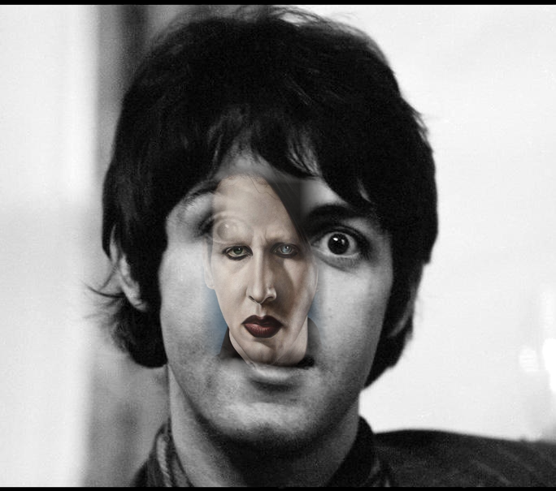

# Attacking Adversa Challenge

This is the code for my winning entry to the 
[Hacking Facial Recognition Challenge](https://mlsec.io/) 
hosted and sponsored by [Cujo](https://cujo.com/) and [Adversa](https://adversa.ai/).

The task of the contest was to change a facial recognition system's prediction from predicting one person to predicting another, 
while not changing the original image too much. For measuring how much an image was allowed to change, the organizers defined a stealthiness score and
valid samples had to maximize the confidence in the desired classification while maintaining a stealthiness score above 50%.

The basic idea of my attack was simply to cut out the target face into the original image. The cutting out is done with the help of some code from
[this repo](https://github.com/timesler/facenet-pytorch).
Of course, doing this cut-and-paste operation naively will usually not result in images that
are sufficiently stealthy so I introduced several parameters like transparency and smoothed-out borders that could then be optimized in a black-box fashion.
The model gets queried many times while all splicing parameters are randomly perturbed. When a move improves the result it gets used as the start point for
the next parameter changes. Over time, the updates become smaller and smaller and in the end the most successful image gets stored. 

The result looks something like the one below. All final points can be found in `adversa_results` and their corresponding confidences and stealthiness 
scores in `evals/results.json`.



# Using the code
If all dependencies are satisfied you can simply store your API key for the challenge as `MLSEC_API_KEY` in a `.env` file and then run 

```python attack_adversa.py```

There are also some hyperparameters that can be passed to the function. Using the `use_alternate_attack` flag uses a slightly modified version of pasting
images that sometimes outperforms. This requires segmentation masks of the target faces (as opposed to just detection boxes) that were generated with the
help of [this repo](https://github.com/zllrunning/face-parsing.PyTorch) and are stored in `segmentation_masks`.
